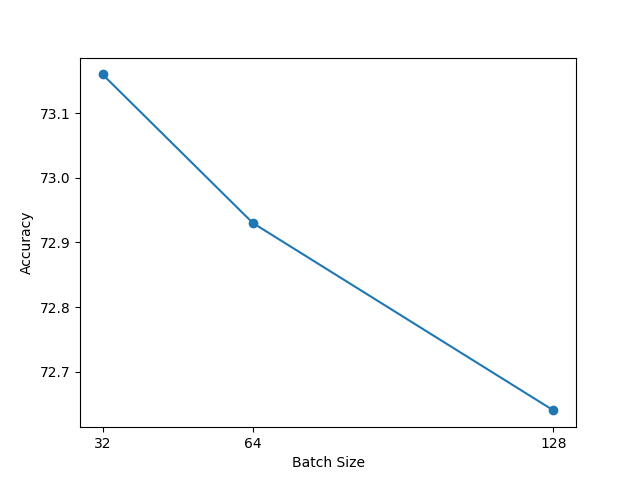

# Common Task 1 : Electron/photon classification

Task : Binary classification of electron/photon particles using resnet15.

Given data contains 498000 samples, each of size 32x32x2 where the channels are hit energy and time.

### Directory Guide:
* `train.py` : Script to train the model.
* `Task1.ipynb` : Jupyter notebook to test the model.
* `model.py` : Contains the model architecture.


### BackBone architecture:

* No.of parameters :  699,618
* Testing accuracy :  73.16 %

* I modified the resnet18 architecture to have 15 layers. I removed the last block which has 4 conv layers and added a single conv layer after the first conv layer to make the network have 15 layers. 
* I also tried replacing the last block with Bottleneck block but the model didn't converge. This motivated me to remove the last block and add a single conv layer to make the network have 15 layers.

Training hyperparameters:
* Batch size : 32
* Learning rate : 0.0001
* Optimizer : Adam
* Epochs : 100

Batch size vs accuracy comparison:


### Guidelines on the code

Before running the code, please ensure the data files `SingleElectronPt50_IMGCROPS_n249k_RHv1.hdf5` & `SinglePhotonPt50_IMGCROPS_n249k_RHv1.hdf5` are present in the same folder as the code.

To train the model:
```bash
python3 train.py --lr 0.0001 --runname <runname> --batch_size 32 --optim Adam
```

For customization, you can add more arguments to the script which can be found in the `argparse` section of the script.

Please see `Task1.ipynb` for testing the model.