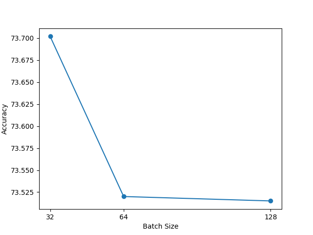

# Common Task 2.  Deep Learning based Quark-Gluon Classification

Task : Classification of Quark and Gluon jets using VGG12.

Given data contains 139306 samples, each of size 125x125x8 impinging on calorimeter.


### Directory Guide:
* `train.py` : Script to train the model.
* `Task2.ipynb` : Jupyter notebook to test the model.
* `model.py` : Contains the model architecture.

### BackBone architecture:

* No.of parameters :  4,242,418
* Testing accuracy :  73.7 %    

* I modified the VGG16 architecture to have 12 layers. 

Training hyperparameters:
* Batch size : 32
* Learning rate : 0.0001
* Optimizer : Adam

I tried SGD too but the model didn't converge. This motivated me to use Adam optimizer.

Batch size vs accuracy comparison:


### Guidelines on the code

Before running the code, please ensure the data files `QCDToGGQQ_IMGjet_RH1all_jet0_run0_n36272.test.snappy.parquet`, `QCDToGGQQ_IMGjet_RH1all_jet0_run1_n47540.test.snappy.parquet` & `QCDToGGQQ_IMGjet_RH1all_jet0_run2_n55494.test.snappy.parquet` are present in the same folder as the code.

To train the model:
```bash
python3 train.py --runname <runname>  --optim Adam --batch_size 32 --gpu cuda
```

For customization, you can add more arguments to the script which can be found in the `argparse` section of the script.

Please see `Task2.ipynb` for testing the model.