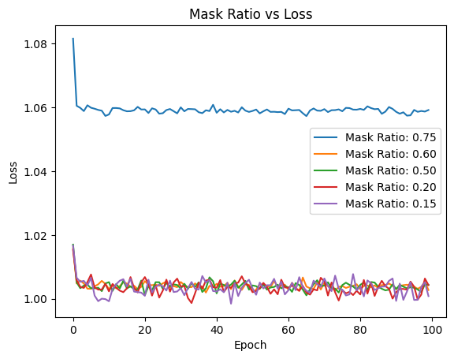

# Specific Task :  Masked Auto-Encoder for End-to-End Particle Reconstruction project

Do

### BackBone architecture:
I used the default ViT-MAE architecture with modified number of layers and dimensions.

Here are the network hyperparameters:
* decoder depth : 8
* decoder dim : 128
* encoder depth : 12
* encoder dim : 256
* encoder heads : 4
* decoder heads : 8

Following the motivation from the paper, I used more parameters on encoder side rather than decoder side. This forces the encoder to learn more complex features and then by using any decoder, we can generate the output correctly.

This can be seen in the network's hyperparamters. Except heads, all other parameters are more on encoder side than decoder side. This is due to the fact that original ViT-MAE used this kind of setting.



It is evident from the above that very high masking ratio of 75% is too much unlike the ViT-MAE. However, a 60% masking ratio seems fine. This might be due to random weight initialization. I believe it can be improved by multiple runs.

* For fine-tuning, I used a linear layer and fine-tune the whole model. 

### Guidelines on the code 

#### Pretraining
Pretraining script can be found as `apretrain.py`. It uses `argparse` library to parse the arguments from terminal. The script can be run as follows:

```bash
python apretrain.py --runname <runname>
```

For customization, you can add more arguments to the script which can be found in the `argparse` section of the script.

#### Fine-tuning
Pretraining script can be found as `apretrain.py`. It uses `argparse` library to parse the arguments from terminal. The script can be run as follows:

```bash
python afinetune.py --runname <runname> --wpath <path to the pre-trained weights> 
```

For customization, you can add more arguments to the script which can be found in the `argparse` section of the script.

For more details, you can refer to `scr1.sh` , `scr2.sh` and `scr3.sh` which are the scripts to run the pretraining and fine-tuning scripts.